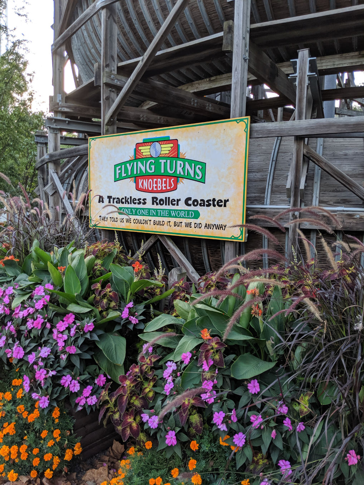

# BABLR is in Beta

I am thrilled to announce that after three years of initial development, BABLR is "in beta". If you're willing to pardon the rough edges that remain, everything described in the rest of this post is released ([on npm](https://www.npmjs.com/package/bablr)) and ready for testing.

What we're announcing is not just a new product, but a new kind of product: an API-first, hackable IDE that runs in the web browser. We aim to go toe to toe with VSCode by building something new and different all the way down to the core architecture.

What this means is that what we're releasing today is not one product but an entire headless tech stack -- everything except the UI:

- We're releasing CSTML, which is an untyped, language-agnostic serialization format for code. CSTML was inspired by HTML, XML, and [SrcML](https://www.srcml.org/).
- We're releasing agAST, which is a way of embedding CSTML code in immutable Javascript objects and arrays. It competes with [ESTree](https://github.com/estree/estree) and [unist](https://github.com/syntax-tree/unist).
- We're releasing BABLR (Babel Ass-Backwards for Language Recognition), which in addition to being the name we use for the whole ecosystem is the name of our novel system for building extensible streaming parsers (and of course, also nod to [ANTLR](https://www.antlr.org/)). BABLR parsers return CSTML documents along with a set of strong, language-specific guarantees about the schema of the data stored in those documents.
- We're releasing a mostly-complete language definition for Javascript.

Together these these technologies offer all the APIs and implementations necessary for defining a fully functioning IDE with all the luxuries of VSCode and more. Yet where VSCode's implementation consists of millions of lines of code our, more powerful system is implemented in tens of thousands.

If you're eager to try out the code we've tried to make things as self-explanatory as possible as matter of principle, but you should still consider joining our [Discord server](https://discord.gg/NfMNyYN6cX): it's our primary venue for providing support and development updates. If you want to skip all this narrative and jump right in, head on over to our homepage: [https://bablr.org](https://bablr.org)

## Why do this?

Because we realized we could, and [because Gary Bernhardt dared us to](https://www.destroyallsoftware.com/talks/a-whole-new-world).

But also because the next generation of programmers is going to be writing code on phones and tablets, and writing code in languages other than English. We wish to break down the barriers that are preventing more people having basic code literacy and sharing ownership of codebases so that it becomes more common to find people who own software rather than finding people whose lives are owned by software.

## How far are you?

While our project has been open (on [Github](https://github.com/bablr-lang/) and [Discord](https://discord.gg/NfMNyYN6cX)) throughout its development, this is the first release we have ever documented and publicized.

This is in large part due to the nature of developing a bootstrapped system (a system defined in terms of itself). Trying to develop such a system is not unlike the experience of trying to walk with your shoelaces laced together. The "shoes" in a boostrapped system inevitably come to be called "the frontend" and "the backend". Adding to the way they relate is like adding a word to the dictionary: if you're defining a word that will be used in common speech, you'll need to both write down the definition, but also if the word is really common it will be natural to use it in many other definitions. There's a bit of a puzzle here: does the meaning come from writing down the definition of the word, or from using it as the definition suggests it would be used? We don't need to resolve that puzzle, all it really means is that if your shoelaces are tied together and you want to move forward you'll have to pick the left or the right foot to move first or you're sure to topple.

This is a long-winded way of saying that while we have built many working, useful implementations, our purpose in making them was primarily to learn from them in order to design the next generation of frotend/backend contract.

Thus, the packages we are releasing today are both the result of a many generations worth of steady innovation on core abstractions and architecture, but also a great deal of stability improvement and testing in the last weeks and months -- more than we have ever done on any previous version.

That said, today the technology isn't ready for mass adoption yet. What we need badly are early adopters: people to come try building new tools and to try defining new languages.

If you might be one of those people, know that this tool won't yet do everything that your other tools can do, but we strongly suspect that the tools we are releasing today will be able to do some things that no other tool you've tried to has been able to. For example:

- Using our tools you can stream parse and syntax highlight and infinite stream of data like a live chat, or do a structural search on a file whose contents are too large to fit in memory.
- You can use Javascript to do API-driven transformations on code written in any parseable language.
- You can share immutable trees between different tools without duplicating the work of schema validation.
- You can use our APIs to build a browser-based semantic code editor. With a CSTML document holding all the editor state, we built a simple semantic code editor in just a few hundred lines of code.

Since we _need_ language definitions to power all our other capabilities, we'll be relying on the community to help us build out [a whole library of supported languages](https://bablr.org/languages)!

For the aspiring parser author, we've written [a basic tutorial](https://docs.bablr.org/guides/parser/) to help get you on your way, and thanks to our lovely [parser playground](https://bablr.org/playground) you can even define a new language without leaving your web browser if you want.

## A DOM for Code

At the heart of a BABLR-based tool is a CSTML code document. CSTML stands for "Concrete Syntax Tree Markup Language." Such a syntax is one of the simplest kinds of developer tool: when complex data is built up in memory it starts to get hard to use even a good debugger to quickly understand exactly what's in it. You start to wish you had some sort of concise 2D representation that you could visually scan, leveraging your brain's natural talent for pattern recognition and language!

The goal of such a representation is not to be formally precise about how the data is stored, but rather to communicate the intended meaning _regardless of how the data is stored_.

That's why one of our biggest goals was to create an system that could replicate the magic of the browser's `Right click > Inspect Element` workflow


We designed CSTML with the goal of making it general enough to replace the many (20+) ad-hoc syntaxes we had seen for presenting similar data in other debugging tools:


We knew we had made the right choice when we could feel our own fear and stress levels lowered by being able to use our tools -- tools we started to trust.

We build a trust relationship with any tool we use in fact. That encompasses things like whether the tool has weaknesses or design flaws, and whether we are sure our mental model of how to use the tool is correct. But critically in software development switching to a new programming language usually means switching to new tools, and this is a major part of why programming literacy is often highly language-specfic and even ecosystem-specific. To be a productive developer you need not just CS knowledge, but a working relationship with a set of tools that you know and trust.

We hope that by creating one set of tools that is general enough for any purpose, we will substantially lower the barriers to entry for software develpment as a whole while making it much easier for coders to take their talents with them from one language to another.

We also hope that the APIs we are offering will be something of an antidote the modern AI narrative, much of which rests on the idea that coding is such an unpleasantly labor-intensive task that the best approach is not to improve the tools but to make someone other entity do the laborious parts of using them.

## It looks like this!

Regex is a notoriously cryptic-looking language. Lets use CSTML to explore the syntax of a visually disorienting Javascript regex like `/[[^.?/]/`. To help you understand CSTML more easily, I've avoided using any syntax sugar, and I've arranged the "tags" that together make up the document stream with each tag on its own line.

```cstml
<!0:cstml { bablrLanguage: 'https://bablr.org/languages/core/en/bablr-regex-pattern' }>
<_>
  .:
  <Pattern>
    openToken:
      <*Punctuator { balanced: '/', balancedSpan: 'Pattern' }>
        '/'
      </>
    alternatives[]:
      []
    alternatives[]:
    <Alternative>
      elements[]+:
        []
      elements[]+:
      <CharacterClass { negate: false }>
        openToken:
          <*Punctuator { balancedSpan: 'CharacterClass', balanced: ']' }>
            '['
          </>
        negateToken:
          null
        elements[]+:
          []
        elements[]+:
          <*Character>
            '['
          </>
        elements[]+:
          <*Character>
            '^'
          </>
        elements[]+:
          <*Character>
            '.'
          </>
        elements[]+:
          <*Character>
            '?'
          </>
        elements[]+:
          <*Character>
            '/'
          </>
        closeToken:
          <*Character { balancer: true }>
            '['
          </>
      </>
    </>
    separatorTokens[]:
      []
    closeToken:
      <*Punctuator { balancer: true }>
        '/'
      </>
    flags:
      <Flags>
      </>
  </>
</>
```

Let's pick apart a few specific lines from this example. The document starts with a "doctype tag" which looked like this:

```
<!0:cstml { bablrLanguage: 'https://bablr.org/languages/core/en/bablr-regex-pattern' }>
```

The most basic form of the tag is simply `<!0:cstml>`, and it indicates the text following is CSTML. The doctype tag includes a `bablrLanguage` attribute and specifies a particular schema validator (parser) which can be used to verify the semantic validity of the document's contents. `0` is a version which allows us to make future versions of the language if we need to.

```
<*Character>
  '^'
</>
```

This three-tag combo makes up a node, in this case an open node tag, a literal tag, and a close node tag. To save space and visual clutter we often abbreviate such a node as one self-closing tag, like this: `<*Character '^' />`. This particular node is marked with the `*` flag, which means that its children will be literal strings instead of other nodes.

The literal tag, `'^'`, contains a bit of the program's original source code. If you print the content of each of these literal strings in the order they appear in the CSTML document, you will get the original source code. In this example the literals are `'/'`, `'['`, `'['`, `'^'`, `'.'`, `'?'`, `'/'`, `']'`, and `'/'`, which together make up the original text `/[[^.?/]/`. This ensures that CSTML documents can be represented visually as their syntax.

Another kind of tag that you'll see in the example document is the "reference tag", for example `openToken:`. This represents a slot where a node could be attached, and describes how the node that goes there would be related to the referencing (outer) node. This was a key learning that we took from studying syntax trees: what kind of thing you are, like `Punctuator` is conceptually distinct from how you are related to your parent. Both `openToken:` and `closeToken` are different relationships to punctuator children from within the same parent node.

If you want to see this output for yourself or get documents explaining other patterns, you can do it in the [BABLR CLI](https://www.npmjs.com/package/@bablr/cli):

```bash
bablr -l @bablr/language-en-regex-vm-pattern -p Pattern <<< '/[[^.?/]/'
```

A full explanation of all CSTML syntax is beyond the scope of this blog post, but you can find it [in our docs](https://docs.bablr.org)

## The economics of open source

For the past four years, I, Conrad, have had no professional undertaking other than writing this software. Stirling Hosstetter has been working with me full time on it for the past year and half, and without his help and support I have no doubt that this project would have [sunk into the swamp](https://www.youtube.com/watch?v=w82CqjaDKmA) long before I was in a position to be able to write such a celeberatory blog post.

Despite the fact that we are celebrating today though, in part we're celebrating how much work there is left to do. It is truly thrilling and terrifying to try building something genuinely new and different
-- to have the chance of not just living up to someone else's measure of success, but to create your own measure and succeed by that.



We understand why companies like Cursor and Windsurf preferred to fork VSCode. They get a major boost to adoption by telling users they can keep all their VSCode plugins. They are then able to skip the phase of needing to invest in building out an ecosystem, but they also pay a price: they are locked in. Any contribution to their ecosystem is also a direct contribution the ecosystem of their biggest competitor, leaving unable to really get ahead. Microsoft knows these companies have a shallow moat, and is already working to cross it.

By rejecting the status quo we left ourselves with the unenviable task of building out a whole ecosystem just to be able to get a baseline level of support expected of serious competitors in the IDE space. We know that this is more work than two people could ever do, which is why we have focused our energy on being inclusive of a diversity of constituencies: in other words, we will grow reliably when it's worth it for a new user to make a technical contribution in order to have access to all the contributions other users have made before. When these conditions are met, the result is exponential growth.

Because we've invested so much of our own blood sweat and tears into this effort, Stirling and I have together cofounded Silphium Labs, a company which, like us, has no money.

Silphium, having spent less than a half-mil to develop its unique competitive edge -- what we think is the biggest shake-up in IDEs for the last 20 years -- is about to [step into the BattleBox](https://www.youtube.com/watch?v=oVZ70KleGEA) with established competitors receiving valuations ranging from the [millions](https://voidzero.dev/) to the [billions](https://www.reuters.com/business/openai-agrees-buy-windsurf-about-3-billion-bloomberg-news-reports-2025-05-06/).

So... if you're interested in becoming an investor in Silphium Labs, please do not hesitate reach out Stirling and I! I try to be responsive to all human-written messages sent to [conartist6@gmail.com](mailto:conartist6@gmail.com).

If you would prefer to directly support the growth of the open community instead of getting involved with a for-profit, we are happy to be able to accept non-profit contributions through [our OpenCollective](https://opencollective.com/bablr)!

And if you're able to contribute code, documentation, evangalism, or even just some good cheer, we'd love to welcome you to our community of contributors, and to the [BABLR Discord](https://discord.gg/NfMNyYN6cX).

Finally, if you think we've done good engineering work and would like us to apply our talents to your gnarly engineering problems, we are offering our services as consultants.

## Thank you

If you're still reading I thank you for taking the time to be here with us today on this day that we are celebrating, for in writing this I will have succeeded by my own measure. I think I will have secured the continued existence and growth of this work.

To all the people who have lent a helping hand or a listening ear, thank you, and to all the people with whom I have argued bitterly, thank you as well.
